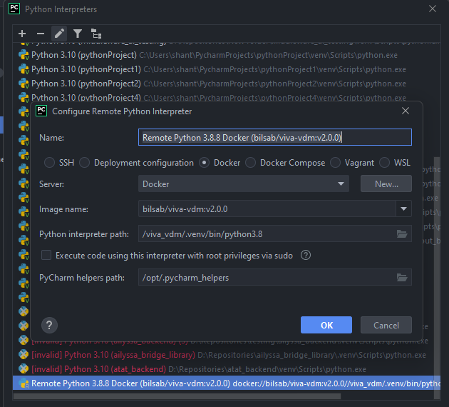

# viva_vita
The Vaccine Design Module of the ViVA Project.



/viva_vdm/.venv/bin/python3.8 is the path to Python in the image

**Python Console startup:**
```python
sys.path.extend(['/viva_vdm', '/mhc_i/src', '/mhc_ii'])
```
